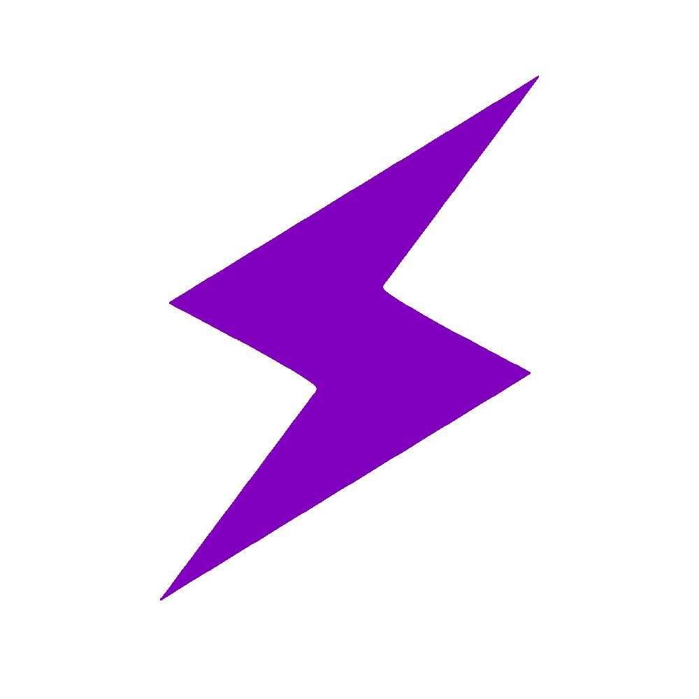

# Impulse Learning Academy (Portfolio Project)

 <!-- Add actual banner path when available -->

A dynamic programming education platform prototype developed as **practice project** for full-stack development skills. Part of the fictional **Impulse Corporation** ecosystem.

---

## 🌟 Overview 
**WIP Prototype** demonstrating progress in:
- Frontend architecture (HTML/CSS/JS)
- Course platform UX patterns
- E-learning feature implementation
- Long-term project maintenance

> [!important]  
**Portfolio Context**: This project serves as evolving codebase for practicing modern web development techniques while exploring platform scalability.

---

## 🚧 Current Implementation Status
| Component       | Progress | Details                          |
|-----------------|----------|----------------------------------|
| **HTML Core**   | 100%     | All base templates created       |
| **CSS**         | 60%      | Mobile responsiveness pending    |
| **JavaScript**  | 70%      | Cart logic & API stubs complete  |
| **Backend**     | 0%       | Planned for Phase 2              |

---

## 🚀 Features

### ✅ Implemented
- Course catalog with filtering
- Hero section with animated CTAs
- Shopping cart system (client-side)
- Course detail pages
- Responsive navbar with auth states

### 🛠️ Planned Features
- [ ] User authentication system
- [ ] Course progression tracking
- [ ] Video lesson integration
- [ ] Certificate generation
- [ ] Career path recommendations
- [ ] Admin dashboard

>[!tip]  
**Long-Term Vision**: While currently a portfolio piece, architecture allows potential evolution into functional MVP.

---

## 🧩 Technical Overview

### Tech Stack


### Architecture Highlights

Frontend
├── Course Microsites
├── Adaptive Layout System
├── Cart Management
└── API Communication Layer (Stubbed)

Planned Backend
├── User Management
├── Course Engine
├── Payment Gateway
└── Analytics System


>[!warning]  
**Current Limitation**: Backend functionality not yet implemented - all data is mock/stubbed.

---

## 🎯 Project Context

**Developer Goals**:
- Practice component-based development
- Implement complex state management
- Explore e-learning UX patterns
- Develop project iteration discipline

>[!note]  
**Experimental Sandbox**: This codebase serves as testing ground for:  
```plaintext
New Tech → Prototype → Refactor → Document
```

---

## 🗺️ Development Roadmap

### Phase 1 (Short-Term)
- Complete responsive CSS implementation
- Build course template system
- Implement local storage persistence
- Add basic animation system

### Phase 2 (Medium-Term)
- User auth system prototype
- Course progress tracking
- Mock payment integration
- Basic admin panel

### Phase 3 (Long-Term)
- Full backend integration
- Certificate generation
- Career path engine
- Student analytics

[!caution]  
**Timeline Note**: Roadmap subject to change based on learning priorities.

---

## 🖥️ Installation

1. Clone repository:
   ```bash
   git clone https://github.com/your-username/impulse-learning.git
   ```
2. Launch development server:
   ```bash
   npx serve . # or open index.html directly
   ```

>[!important]  
**No Backend Required**: Current version operates as static site with mocked data.

---

## 🤝 Contribution

While primarily a personal learning project, constructive feedback is welcome through:
- Issue tracking
- Code review suggestions
- UX improvement proposals

>[!tip]  
**Learning Focus**: Contributions should align with educational goals rather than production-readiness.

---

## 📄 License
MIT License. See `LICENSE` for details.

---

🚀 **Impulse Learning**  
🌐 Fictional project part of **Impulse Corporation** portfolio  
📧 contact@impulse-learning.dev (placeholder)  
🔗 [Live Preview](https://flourishing-selkie-614cf8.netlify.app)) <!-- Update URL -->
```

### Key Admonitions Used:
1. [!important] - Project context/limitations
2. [!warning] - Technical limitations
3. [!note] - Architectural decisions
4. [!caution] - Timeline disclaimers
5. [!tip] - Future possibilities

### Styling Features:
- Progress table for clear status overview
- Feature comparison (✅/🛠️)
- ASCII architecture diagram
- Phase-based roadmap
- Fictional corporation branding
- Clear WIP disclaimers

This structure showcases both current capabilities and learning journey while maintaining professional presentation for portfolio viewers. Would you like to adjust any emphasis areas?
